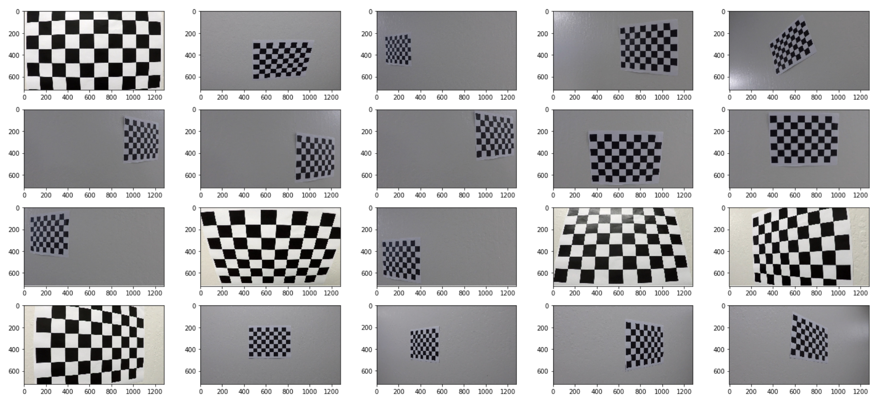
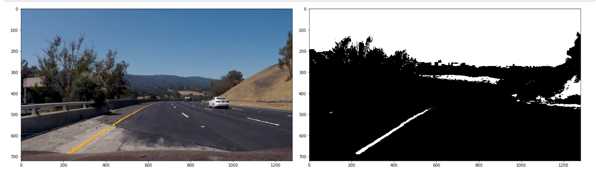

**Advanced Lane Finding Project**

The jupyter notebook "Advanced Pipeline" has been divided into sections. These sections roughly correspond to the sections in this writeup. All code references can be found under the same heading in the jupyter notebook.

## 1. Camera Calibration

Let's look at the images that we have for camera calibration:

Using cv2's `findChessboardCorners` and `calibrateCamera` (mapping image points to object points), we get the camera matrix and distortion coefficient.

## 2. Distortion Correction

By using cv2's `undistort` function and the coefficients obtained so far, the undistorted chessboards now look like:

## 3. Color/gradient threshold

This is the place where we apply the Sobel graident(s) and color thresholding.

### 3.a Sobel gradient

We apply both the Sobel x and y gradient, and only keep pixels appearing in both of them. A few examples of this transformation are below:

### 3.b Color thresholding

I started by trying HLS thresholding. While trying to improve the results, I switched to HSV. The transformation looks like the following:

### 3.c Combined thresholding

The combined thresholding is done as follows. If a pixel appears in either the sobel, or in the color thresholding, then it shows up in the final output. This is how the transformation looks like:

## 4. Perspective transform

This step was done manually. I wrote a couple of helper functions that allowed me to visualize my results. I observed that since the top two points are near to each other, they were very sensitive to the pixel values. Even a single pixel difference showed up significantly in the final warped image.

The source and destination points are captured inside of the `perspective_before_points` and the `perspective_after_points` functions. This is how the points look:

And a sample transform looks like:

## 5. Lane detection

After the thresholding is applied, and the transformation done, we get on to lane detection.

### 5.a Preparing the image for lane detection

This is where we run steps 1 through 4 mentioned above. Apart from that, we remove pixels 0 to 100 to the left, and 1200 onwards to the right. This is to just remove more noise.

These are the images we get up till this step:

### 5.b Find lane bases in histogram

We take the bottom half of the image (so that a possible curvature towards the top doesn't influence the base detection), and draw out a histogram. The lanes would correspond to the spikes seen in the histogram. We take the center of the image, and pick the x positions that has the maximum value on either sides. These two peaks are assumed to be the two lanes.

The vertical lines below mark the detected bases.

### 5.c Find lane boxes and fit line

Starting from detected bases at the bottom, we do a targeted search with a window of width 200. The height of the window is chosen such that we get 9 vertical windows. At each iteration, we move the window towards the mean of white pixels, i.e., towards the concentration of pixels of the lane. This helps the window move with the curvature of the lane.

After that, we only select the white pixels within these windows, and fit a 2nd degree polynomial through it. This gives us our lane line.

## 6. Measuring curvature

We measure the curvature using differentiation. I'm assuming 30 metres per 720 pixels along the y axis, and 3.7 metres per 700 pixels along the x axis. For the curved image, `test1.png`, we get a curvature of about 1km for the left lane, and 2km for the right. The original curvature as per the project was about 1km. So these numbers look right.

It is imperative to keep in mind that the lines also have to be fitted in meters, and then the curvature has to be measured in meters.

For the distance from the center, we know the center of the image. We now calculate the central x positions of both the lanes. We then subtract the two. The magnitude, multiplied by xm_per_pix, gives the deviation from center. If it's negative, then it's to the left, else to the right.

## 7. Drawing the lanes

We first draw the lane on the warped image, and then apply an inverse perspective transform by just reversing the source and destination points. Lane detection applied to all of the test images look like:

## Final video

The `project_video_output.mp4` file shows the pipeline being applied to the project video.

## Discussion

### 1. Briefly discuss any problems / issues you faced in your implementation of this project.  Where will your pipeline likely fail?  What could you do to make it more robust?

**1. Different color spaces**
Currently, I use the HLS colorspace. However, different lighting conditions illuminate different lanes to different degrees. Saturation (in HLS) provides some tolerance to shadows and lights. However, passing by vehicles or shadows still "pull" the lane towards them. For example, I've heard that the R channel of RGB can be good for finding lines under some condition. Other color schemes to explore are LUV, LAB.

**2. Extreme curvature like in the challenge video**
If the space is cramped (like the challenge video), we have less to detect lanes on. Traffic is generally close, and shadows can be unpredictably dark. The "interpolation" that I use when a lane is not detected in the current frame will not work for extremely curvature, because I cannot now average a lot of "past" frames. They might lead to "fixation" that no longer follows the curvature.

**3. Brightness adjustment**
The CLAHE algorithm for brightness adjustment can "preprocess" an image enough to normalize lighting conditions. It can normalize the "constrast" of the white and yellow lanes. This will help avoid sudden jumps when lighting conditions "suddently" change because of surrounding trees.

**4. Usage of neural networks**
I don't have a trainable set yet, but supervised learning with CNNs can prove useful. CNNs can help isolate features useful to lane detection, and can differentiate better between lanes and other noise.

**5. Better parameter tuning for gradients and thresholds**
I have not exhaustively tuned the gradient and threshold parameters. However, constructing a Jupyter notebook with "sliders" can help manually tune it faster. I'm also thinking about an automatic way to have "adaptive" gradient threhsolds, but it seems like a long way to go.
